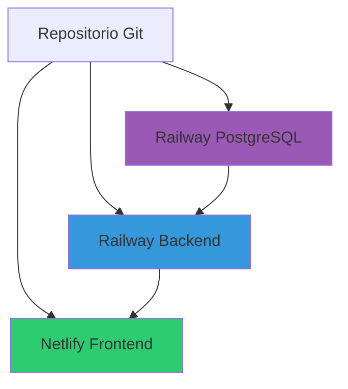

# 🚀 Sistema ERP SaaS - Despliegue en Producción

Este proyecto está configurado para desplegarse en:
- **Backend (NestJS)**: Railway
- **Frontend (Next.js)**: Netlify
- **Base de Datos**: PostgreSQL en Railway

---

## 📚 Documentación de Despliegue

Este repositorio incluye toda la documentación necesaria para desplegar tu aplicación:

### 📖 Archivos de Documentación

1. **[GUIA_DESPLIEGUE.md](./GUIA_DESPLIEGUE.md)** - Guía completa paso a paso
   - Configuración detallada de Railway
   - Configuración detallada de Netlify
   - Variables de entorno explicadas
   - Solución de problemas
   - Mejores prácticas de seguridad

2. **[DESPLIEGUE_RAPIDO.md](./DESPLIEGUE_RAPIDO.md)** - Checklist rápido
   - Lista de verificación paso a paso
   - Variables de entorno mínimas
   - Comandos esenciales
   - URLs importantes

3. **[verificar-deploy.js](./verificar-deploy.js)** - Script de verificación
   - Verifica configuración antes de desplegar
   - Detecta errores comunes
   - Valida archivos necesarios

### 🔧 Archivos de Configuración

- `backend/railway.json` - Configuración de Railway
- `backend/Procfile` - Comando de inicio para Railway
- `frontend/netlify.toml` - Configuración de Netlify

---

## ⚡ Inicio Rápido

### 1. Verificar que todo esté listo

```bash
node verificar-deploy.js
```

### 2. Seguir la guía

Lee [GUIA_DESPLIEGUE.md](./GUIA_DESPLIEGUE.md) para instrucciones completas

O usa [DESPLIEGUE_RAPIDO.md](./DESPLIEGUE_RAPIDO.md) si ya conoces el proceso

---

## 🎯 Resumen del Proceso



### Paso 1: Base de Datos
1. Crear PostgreSQL en Railway
2. Copiar credenciales

### Paso 2: Backend
1. Conectar repo a Railway
2. Configurar variables de entorno
3. Desplegar

### Paso 3: Frontend
1. Conectar repo a Netlify
2. Configurar API URL (del backend)
3. Desplegar

### Paso 4: Finalizar
1. Actualizar CORS en backend
2. Ejecutar migraciones
3. ¡Listo!

---

## 🔐 Variables de Entorno

### Backend (Railway)

Necesitarás configurar ~20 variables de entorno. Las más críticas:

```env
NODE_ENV=production
DATABASE_HOST=<railway-pghost>
DATABASE_PASSWORD=<railway-password>
JWT_SECRET=<generar-clave-segura>
CORS_ORIGIN=https://tu-app.netlify.app
```

### Frontend (Netlify)

Solo necesitas 1 variable:

```env
NEXT_PUBLIC_API_URL=https://tu-backend.up.railway.app/api
```

Ver [GUIA_DESPLIEGUE.md](./GUIA_DESPLIEGUE.md) para la lista completa.

---

## 🛠️ Herramientas Necesarias

- [ ] Cuenta en [Railway](https://railway.app) (gratis)
- [ ] Cuenta en [Netlify](https://netlify.com) (gratis)
- [ ] Repositorio Git (GitHub/GitLab/Bitbucket)
- [ ] Railway CLI (opcional): `npm install -g @railway/cli`

---

## 💰 Costos Estimados

### Plan Gratuito

- **Railway**: $5 de crédito mensual gratis
- **Netlify**: 100GB de ancho de banda gratis
- **Total**: $0/mes (para proyectos pequeños)

### Plan Básico

- **Railway**: $5/mes + uso
- **Netlify**: Gratis o $19/mes para Pro
- **Total**: ~$5-24/mes

---

## 📞 Soporte y Recursos

### Documentación Oficial

- [Railway Docs](https://docs.railway.app)
- [Netlify Docs](https://docs.netlify.com)
- [NestJS Docs](https://docs.nestjs.com)
- [Next.js Docs](https://nextjs.org/docs)

### Problemas Comunes

Ver sección "Solución de Problemas" en [GUIA_DESPLIEGUE.md](./GUIA_DESPLIEGUE.md#-solución-de-problemas)

---

## 🔄 CI/CD Automático

Una vez configurado:

- ✅ Push a `main` → Railway autodespliega backend
- ✅ Push a `main` → Netlify autodespliega frontend
- ✅ Zero downtime deployments
- ✅ Rollback automático en caso de error

---

## 📊 Monitoreo

### Railway
- Logs en tiempo real
- Métricas de uso
- Alertas de errores

### Netlify
- Build logs
- Deploy previews
- Analytics (plan Pro)

---

## 🚀 Siguiente Nivel

Después de desplegar:

1. **Dominios Personalizados**: Configura tu propio dominio
2. **SSL/HTTPS**: Habilitado automáticamente
3. **Backups**: Configura backups automáticos de PostgreSQL
4. **Monitoring**: Agrega herramientas como Sentry
5. **CDN**: Netlify CDN global ya incluido
6. **Staging**: Crea environment de staging para pruebas

---

## 📝 Checklist Pre-Despliegue

- [ ] Ejecutar `node verificar-deploy.js`
- [ ] Tener cuentas en Railway y Netlify
- [ ] Repositorio Git actualizado
- [ ] Leer GUIA_DESPLIEGUE.md
- [ ] Generar claves JWT seguras
- [ ] Tener lista de variables de entorno

---

## 🎉 ¿Listo para Desplegar?

```bash
# 1. Verificar configuración
node verificar-deploy.js

# 2. Seguir la guía
cat GUIA_DESPLIEGUE.md

# 3. Desplegar y disfrutar! 🚀
```

---

**Tiempo estimado de despliegue**: 30-45 minutos

**Dificultad**: ⭐⭐⭐ (Media - se requiere conocimiento básico de Git y configuración de servicios)

---

## 📧 Contacto

Si tienes preguntas o problemas durante el despliegue:

1. Revisa la sección de [Solución de Problemas](./GUIA_DESPLIEGUE.md#-solución-de-problemas)
2. Consulta la documentación oficial de Railway y Netlify
3. Verifica los logs de tu aplicación

---

¡Buena suerte con tu despliegue! 🚀✨
